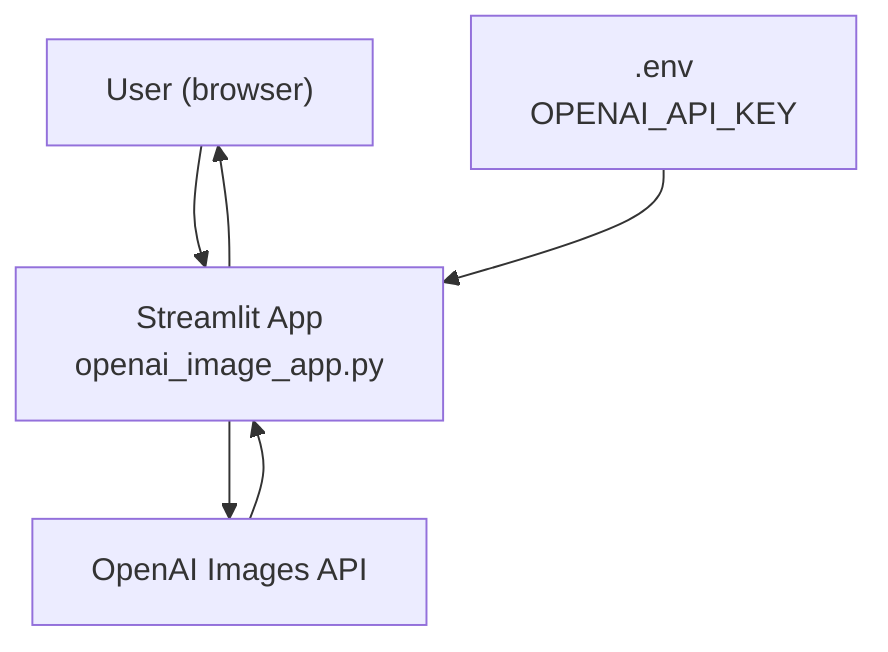
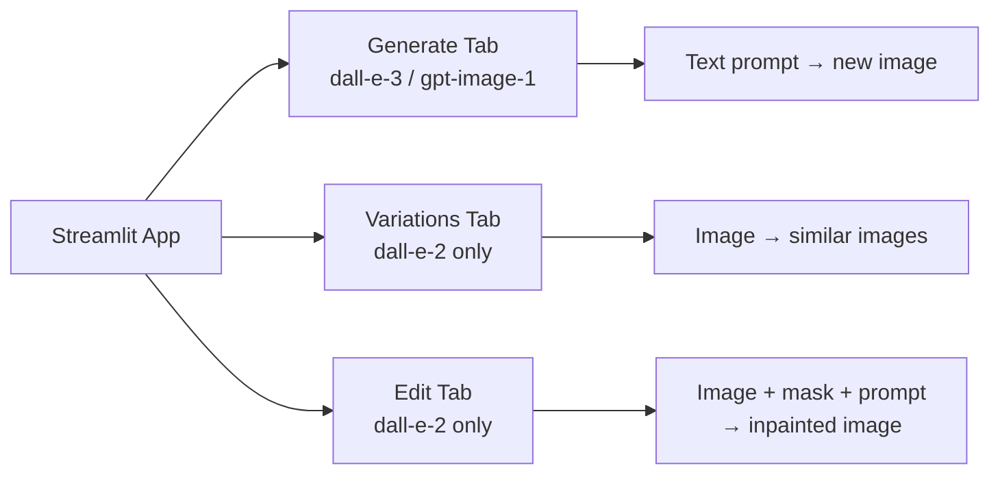
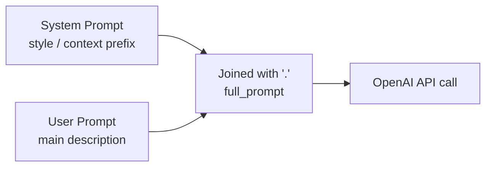
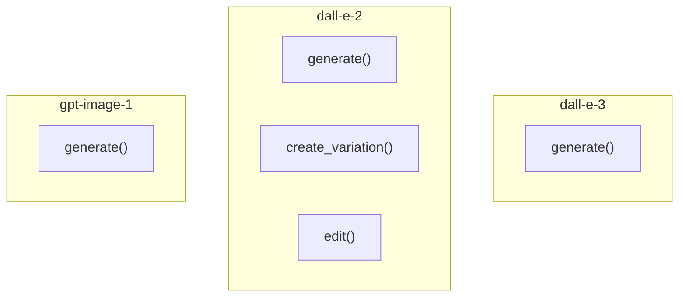
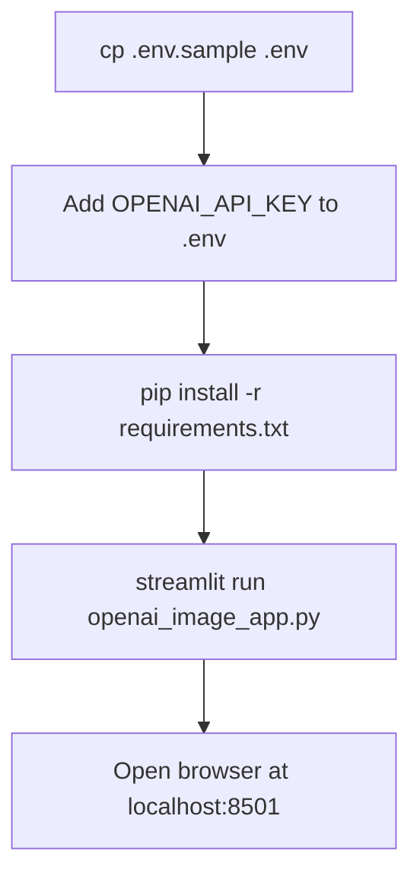
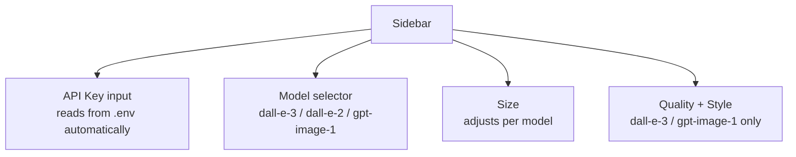
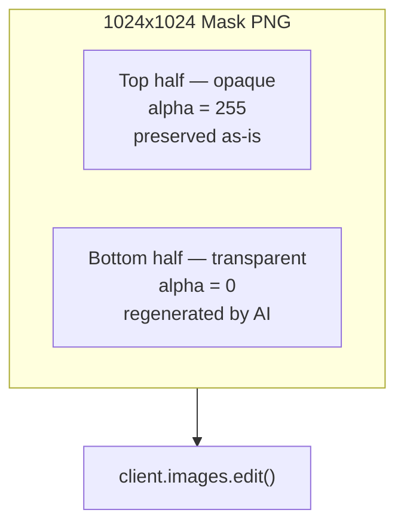
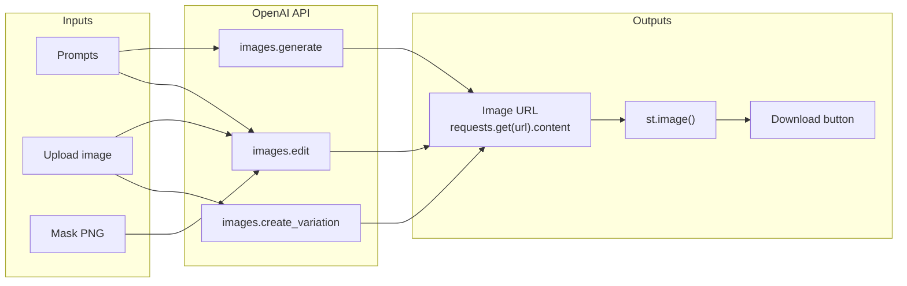

# OpenAI Image Studio

A Streamlit app and companion Jupyter notebook for generating, editing, and creating variations of images with the OpenAI Images API.

---

## Contents

| File | Description |
|---|---|
| `openai_image_app.py` | Streamlit web app |
| `Image_generations_edits_and_variations_with_OPENAI.ipynb` | Step-by-step notebook |
| `requirements.txt` | Python dependencies |
| `.env.sample` | Environment variable template |

---

## Architecture

### App overview



### Three operation modes



### Prompt flow



---

## Supported Models

| Model | Generate | Variations | Edit | Notes |
|---|---|---|---|---|
| `dall-e-3` | Yes | No | No | HD quality, vivid/natural style |
| `dall-e-2` | Yes | Yes | Yes | Required for variations and edit |
| `gpt-image-1` | Yes | No | No | Latest generation model |

### Model capabilities



---

## Setup

### 1. Clone and install

```bash
git clone <repo-url>
cd CNN
python -m venv .venv
source .venv/bin/activate        # Windows: .venv\Scripts\activate
pip install -r requirements.txt
```

### 2. Configure environment

```bash
cp .env.sample .env
# Edit .env and fill in your API key
```

### Environment setup flow



### 3. Run the Streamlit app

```bash
streamlit run openai_image_app.py
```

### 4. Run the notebook

```bash
jupyter notebook "Image_generations_edits_and_variations_with_OPENAI.ipynb"
```

---

## Streamlit App Usage

### Sidebar settings



### Generate tab

1. Enter system and user prompts
2. Select model, size, quality and style in the sidebar
3. Click **Generate Image**
4. Download the result — it is also stored in session state for reuse in the Variations tab

### Variations tab

1. Upload a square PNG (under 4 MB) **or** tick *Use last generated image*
2. Choose how many variations (1–4)
3. Click **Generate Variations** — requires `dall-e-2`

### Edit tab

1. Upload the image to edit
2. Choose mask: **auto bottom-half** or upload a custom transparent-region PNG
3. The prompts from above are used as the edit instruction
4. Click **Edit Image** — requires `dall-e-2`

### Edit mask diagram



---

## Data Flow



---

## File Structure

```
CNN/
├── openai_image_app.py                                 # Streamlit app
├── Image_generations_edits_and_variations_with_OPENAI.ipynb
├── IMAGE_APP_README.md                                 # This file
├── requirements.txt
├── .env.sample
├── .env                                                # Not committed — real keys
└── images/                                             # Generated image output
    ├── generated_image.png
    ├── variation_image_0.png
    ├── variation_image_1.png
    ├── edited_image.png
    └── bottom_half_mask.png
```

---

## .gitignore recommendations

```
.env
.venv/
images/
__pycache__/
*.pyc
.ipynb_checkpoints/
```

---

## Requirements

| Package | Purpose |
|---|---|
| `openai` | OpenAI Images API client |
| `streamlit` | Web app framework |
| `pillow` | Image loading, mask creation |
| `python-dotenv` | Load `.env` API key |
| `requests` | Download images from URL |
| `jupyter` | Run the notebook |
