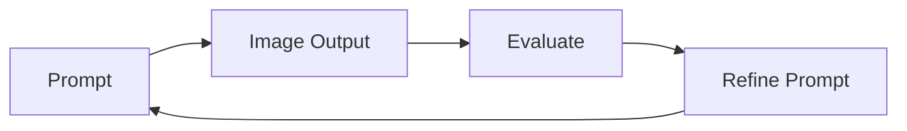

# ORGN 4210 — Week 13 Lab
## Iterating AI Image Generation

---

## Lab Theme

AI systems improve through iteration.

Prompt design is a form of engineering.

In this lab, students will design and refine prompts to generate images aligned with a business goal.

Example scenario:

Create a **performance athletic shoe concept designed for university students**.

Students will explore how prompt structure influences results.

---

## Learning Objectives

Students will:

• learn structured prompting for image models  
• iterate prompts to improve results  
• define evaluation criteria  
• connect design intent to business context  
• practice AI-assisted creative workflows  

---

# Prompt Structure

Effective prompts specify:

subject  
style  
context  
constraints  
details  

Template:

```
subject
style
target user
key attributes
lighting
background
level of detail
```

---

# Baseline Prompt

Start simple.

```
modern athletic shoe designed for university students, comfortable, stylish, realistic product photo
```

---

# Add Context

```
modern athletic shoe inspired by college lifestyle, designed for students walking across campus, sporty aesthetic, realistic product photography
```

---

# University Student Context

```
modern athletic shoe inspired by campus lifestyle, designed for active students, black and gold color palette, realistic product photography, studio lighting, high detail
```

---

# Performance Style Inspiration

Describe characteristics rather than copying logos.

```
athletic running shoe inspired by premium performance footwear design, sleek silhouette, breathable mesh fabric, modern aesthetic, black and gold color palette, realistic product photography, high detail
```

---

# Lifestyle Context

```
athletic running shoe inspired by performance footwear design, worn by a student walking across campus, modern architecture background, fall colors, cinematic lighting, realistic photography style
```

---

# Advanced Prompt

```
premium athletic shoe concept inspired by performance footwear design, sleek lightweight silhouette, breathable knit fabric, black and gold accents, designed for active students, minimal background, soft shadows, professional product photography, high detail
```

---

# Variation Prompts

## Sustainable version

```
eco friendly athletic shoe concept made from recycled materials, minimalist design, neutral colors, designed for university students, modern product photography, soft lighting
```

## Winter version

```
winter athletic shoe designed for cold weather walking, insulated materials, textured sole for snow, modern performance design, realistic product photography
```

## Futuristic version

```
futuristic athletic shoe concept, innovative materials, sleek modern design, designed for active students, studio lighting, high detail
```

---

# Iteration Loop



---

# Evaluation Criteria

Students evaluate:

clarity of design  
visual quality  
alignment with intent  
consistency  
appeal to target user  

---

# Deliverable

Submit:

3 to 5 prompts  
generated images  
short explanation of improvements  

---

# Reflection Questions

What prompt changes improved results

Which words had strongest effect

How does iteration improve quality

How does prompt structure influence output

---

# Optional Extension

Create image concepts for:

final project idea  
product visualization  
marketing material  
interface concept  

---

# Guiding Principle

Small prompt changes can produce large output differences.

Iteration improves quality.
